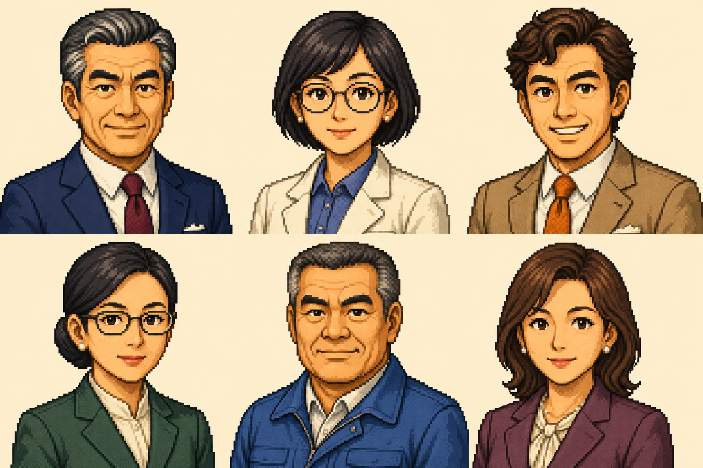

# KADEN WAR — 家電戦争

日本の家電産業の変遷をモチーフにした、ブラウザ向け経営シミュレーションゲームの開発プロジェクトです。プレイヤーは架空の家電メーカーの社長となり、製品開発・生産・販売・財務・組織を動かして業界の覇権を目指します。

**現在のリポジトリ版: V0.0.2 / 企画・設計・アート制作段階。ゲーム本体は未実装です。**

起動できるアプリ、プレイ用URL、ビルド環境、CIはまだありません。以下のゲーム機能と技術構成は計画であり、動作実績ではありません。

## 作りたいゲーム

中心となる体験は「研究投資 → 製品設計 → 開発 → 生産 → 発売 → 市場の反応 → 次の改良」。性能の高さだけでなく、価格・投入時期・品質・販路・資金繰りの組み合わせが結果を左右する経営を描きます。

- 白物家電・映像・音響・パソコンなど、年代に応じた製品開発。
- 直営店・系列店・量販店・ネット販売へと変わる販売戦略。
- 規格・互換性・提携・特許をめぐる競争。
- 月次会議・年度計画・決算を通じた会社運営。
- レトロなドット調グラフィックスと、読みやすい操作画面の組み合わせ。

時代は1960年〜2010年末を仮の範囲としています。シナリオ6本、フリープレイ、チュートリアル、製品図鑑・開発史を製品版v1.0の対象として計画しています。リポジトリのコミット版と製品版の目標は別のものです。

## 担当者と専門パート



承認済みのゲーム調顔原画（1536×1024）。上段左から経営者・設計・販売、下段左から経理・生産・人事。ゲーム画面のスクリーンショットではありません。

| 担当 | 専門パート | 主な判断・報告 |
|---|---|---|
| 経営者 | 社長室 | 全社方針、予算配分、事業参入・撤退、重要案件の最終決裁 |
| 設計統括 | 研究所 | 研究、仕様、性能・省エネ、開発期間、改良 |
| 販売統括 | 販売本部 | 価格、顧客層、販路、販促、販売実績 |
| 経理統括 | 経理部 | 損益・貸借・資金繰り、借入・返済、投資採算 |
| 生産統括 | 工場 | 生産量、設備、品質、在庫、原価 |
| 人事統括 | 人事部 | 採用、配置、教育、人件費、士気 |

社長が各統括の提案を比較し、承認・修正・保留する構成です。数値は共通の会社状態から報告し、部門ごとに別の会計を持たせません。詳しくは[担当別ゲーム設計](担当別ゲーム設計.md)を参照してください。

## 現在あるもの・これから作るもの

| 状態 | 内容 |
|---|---|
| 作成済み | 企画書、要件R01〜R13とS0〜S12の実装計画、担当別ゲーム設計 |
| 作成・承認済み | 6担当の基本表情の顔一覧原画 |
| 作成・形式検証済み | プロジェクト専用の画像制作スキルとプロンプト例 |
| 未実装 | ゲームエンジン、操作画面、シナリオデータ、保存・認証、クラウド配信 |
| 未制作・未検証 | 個別スプライト、表情差分、家電・施設素材、実画面での小サイズ表示 |
| 未整備 | アプリ起動コマンド、依存ロックファイル、自動テスト、CI |

## ドキュメント

| ファイル | 読める内容 |
|---|---|
| [家電戦争企画書.md](家電戦争企画書.md) | コンセプト、製品開発、時代・シナリオ、ゲーム機能、ビジュアル方針 |
| [実装計画書.md](実装計画書.md) | MVPと製品版の範囲、要件、データ・技術案、工程、受入条件、未決事項 |
| [担当別ゲーム設計.md](担当別ゲーム設計.md) | 6担当の責務、会議・決裁、画面導線、キャストと画像仕様 |
| [顔グラフィックス台帳](assets/portraits/README.md) | 承認状態、原画、実際の生成プロンプト、確認済み・残作業 |
| [専用画像制作スキル](.agents/skills/kaden-war-graphics/SKILL.md) | 承認画像を基準に同じ画風を継続する制作手順 |
| [CHANGELOG.md](CHANGELOG.md) | バージョンごとの変更と検証記録 |
| [AGENTS.md](AGENTS.md) | 今後の作業・GitHub向け記載ルール |

企画草案に残る年代・公開範囲などの不整合は、実装計画書の「企画書の不整合と計画上の扱い」で整理しています。草案の選択肢を決定済みの仕様として扱わないでください。

## 技術構成の計画

| 領域 | 採用予定 |
|---|---|
| フロントエンド | TypeScript、React、Vite、Zustand |
| 描画 | Canvas 2D、HTMLによる情報表示・操作 |
| シミュレーション | UIから分離した純TypeScript、シード付きの決定論的状態更新 |
| テスト | Vitest、後続工程でブラウザE2E |
| ローカル保存 | IndexedDB |
| 配信・API | Cloudflare Pages / Workers |
| 任意クラウド保存 | D1、必要に応じたKV |
| CI・配信手順 | GitHub Actions、Wrangler |

依存バージョンと構成は基盤PoCで検証して確定する予定です。基本プレイはローカルで完結し、クラウド保存は任意同期とする設計です。

## ロードマップ

| 段階 | 内容 |
|---|---|
| S0 | 未決仕様とルールの具体化、開発基盤・Cloudflare疎通PoC |
| S1〜S3 | 時間・会計基盤、研究・開発、生産・販売・財務 |
| S4〜S5 | 入門シナリオ、競合、会議、保存、チュートリアルでMVPを構成 |
| S6〜S8 | 人事・経営拡張、規格・特許、全シナリオと自由経営 |
| S9〜S10 | 演出・図鑑・素材、任意クラウド保存 |
| S11〜S12 | バランス・端末別検証、公開準備 |

工程の依存関係と受入条件は[実装計画書](実装計画書.md)に記載しています。顔原画を先行制作していますが、該当工程全体が完了したわけではありません。

## リポジトリの取得と確認

```sh
git clone git@github.com:Satoshi-Hiramatsu/KADEN-WAR.git
cd KADEN-WAR
```

現段階ではMarkdown文書とPNG画像を開いて確認できます。`npm install` や `npm run dev` に対応するアプリはまだありません。アプリ基盤を追加した際に、必要な環境・起動・テスト手順をこのREADMEへ追記します。

```text
.agents/skills/kaden-war-graphics/  # このプロジェクト専用の画像制作手順
assets/portraits/                  # 承認済み顔原画と制作台帳
AGENTS.md                         # 継続作業・記載ルール
CHANGELOG.md                      # 更新履歴
README.md                         # プロジェクトの入口
家電戦争企画書.md
実装計画書.md
担当別ゲーム設計.md
```

## グラフィックスを追加する場合

Codexでは `$kaden-war-graphics` を指定するか、専用スキルを読み込んで制作します。承認済み顔原画を実際に画像参照として使い、描画密度・暖色系の配色・輪郭・陰影を揃えます。既存人物の差分では顔立ち・髪型・服装を維持します。

原画を上書きせず、版を付けて保存し、生成プロンプト・参照元・確認結果・承認状態を台帳に残します。顔原画以外の製品・施設素材は今後の制作対象です。

## 更新と検証の方針

今後も機能・設計・画像の変更に合わせて、README・更新履歴・関連仕様を詳しく更新します。変更理由、利用者から見た結果、確認したこと、未確認の制約を記載し、未実装機能や未測定の性能を実績として示しません。

現在は文書リンク・画像寸法・専用スキル形式などを検証しています。ゲーム本体のビルド・動作テストは、実装が存在しないため未実施です。

## 素材・名称の扱い

人物は独自の架空人物として生成しています。企画書内の実在名称・参考名称は企画上のモチーフであり、公開用名称の確定を意味しません。ライセンスは現時点で未設定です。
