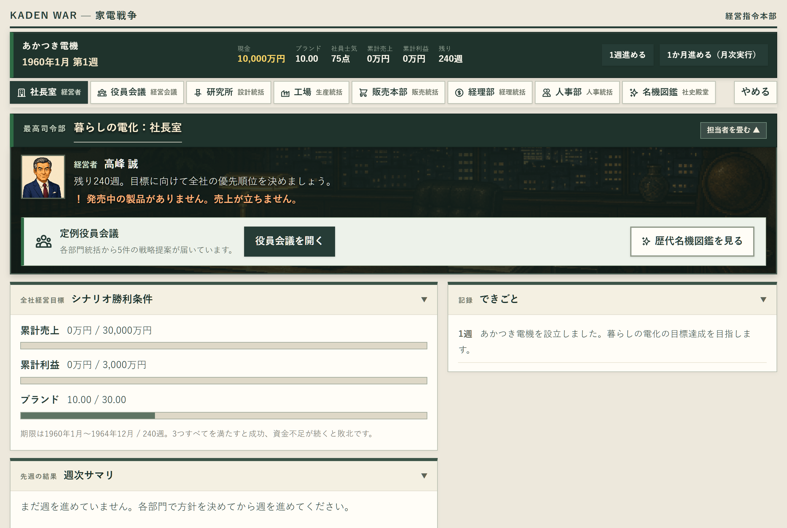
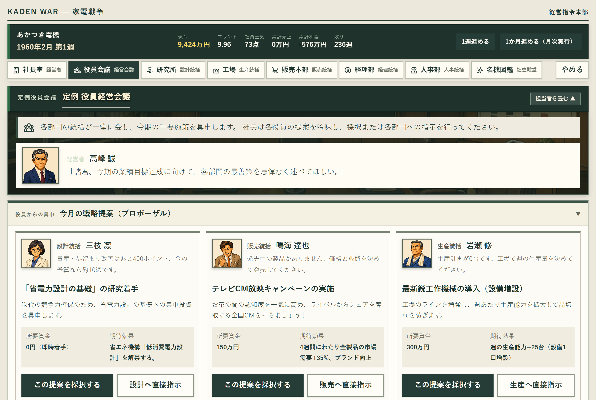
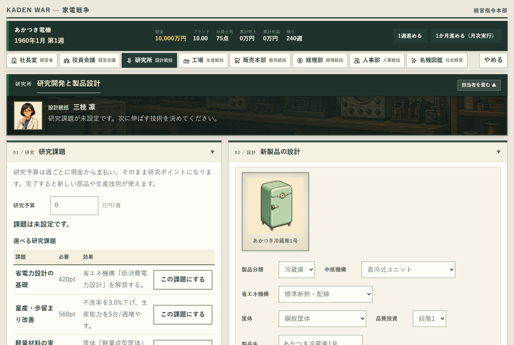
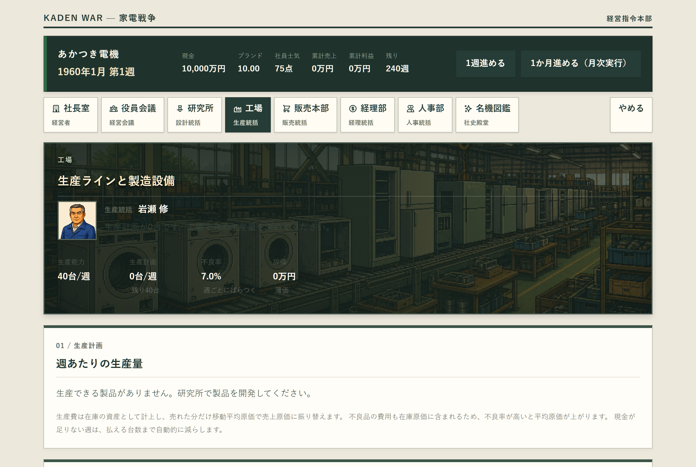
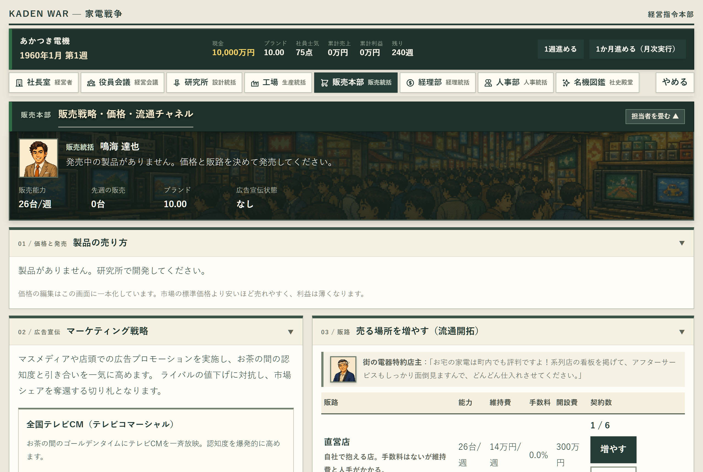
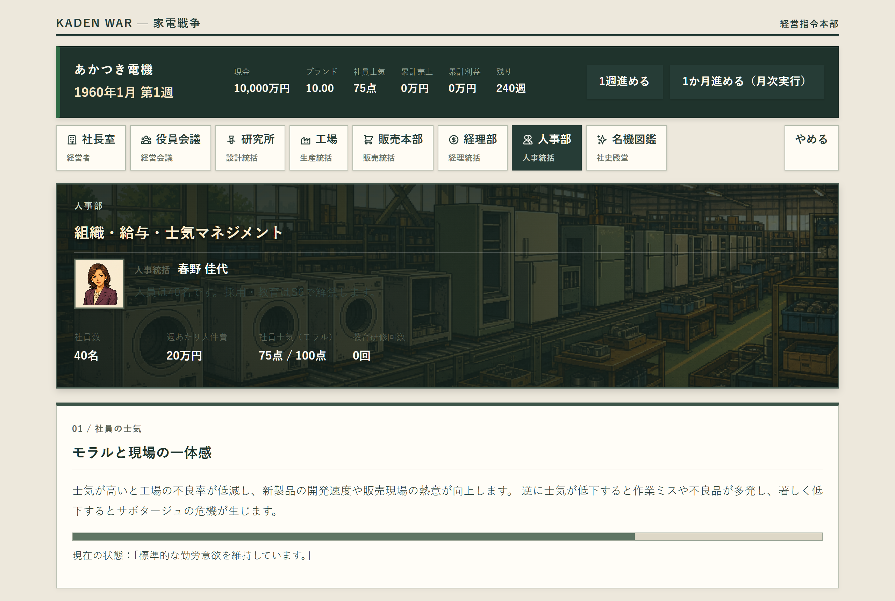
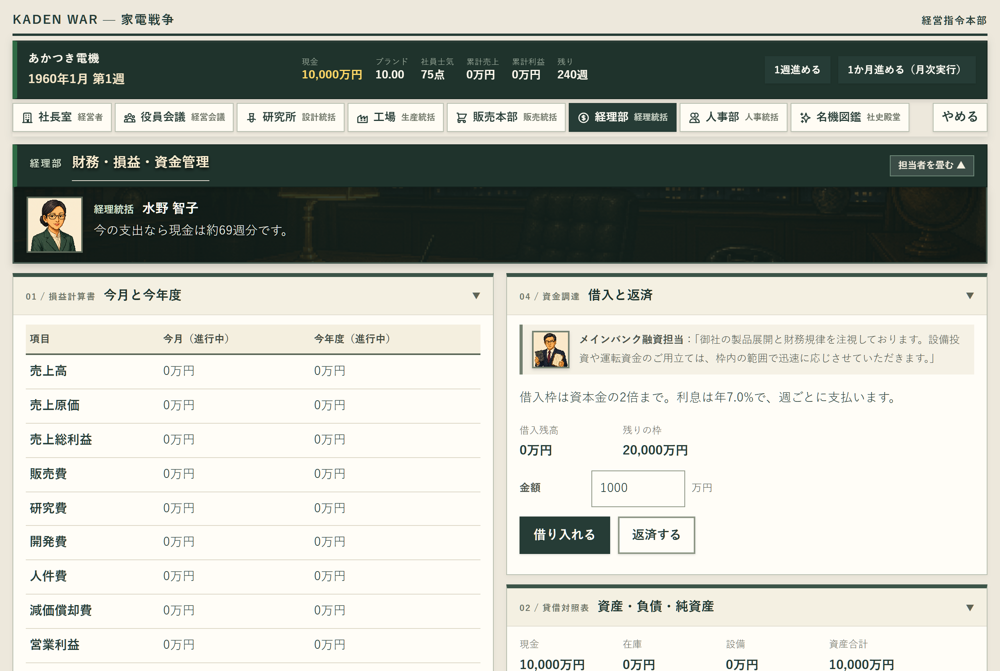
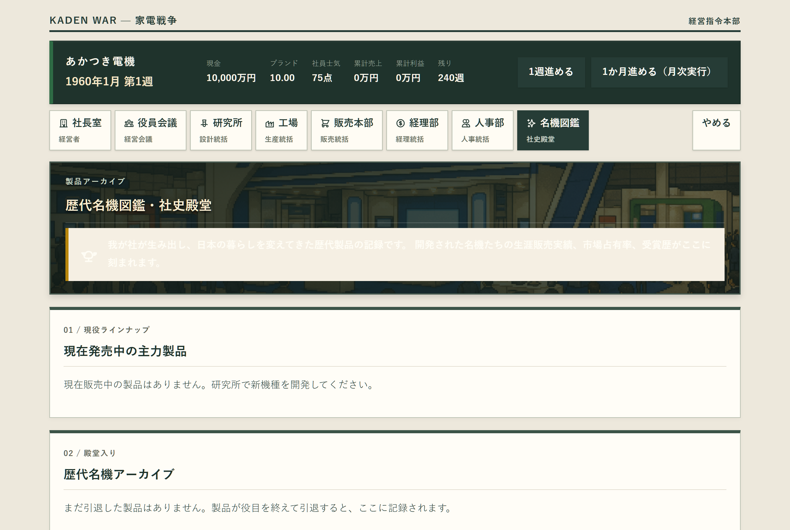

# KADEN WAR — 家電戦争

日本の家電産業の黄金期と技術革新の変遷をモチーフにした、ブラウザ向け本格経営シミュレーションゲームです。
プレイヤーは新興家電メーカー「あかつき電機」の代表取締役社長となり、研究・設計・生産・販売・財務・人事の6部門を指揮して、激動の時代を生き抜き業界の覇権を目指します。

[](https://kaden-war.molkz.com/)
[](CHANGELOG.md)
[](tsconfig.json)
[](#素材名称の扱い)

🎮 **本番公開URL**: [https://kaden-war.molkz.com/](https://kaden-war.molkz.com/) （PCブラウザ・スマホで即時プレイ可能）

---

## ゲーム画面ギャラリー

本ゲームは、90年代の本格国産経営シミュレーションゲーム（PC-98 / スーパーファミコン黄金期）の重厚なプレイ感と操作性を現代のWebフロントエンド技術で再現しています。

### 1. メイン画面 — 社長室 & 役員会議室
| 社長室（全社KPI・時代イベント速報・競合動向） | 定例役員会議（月初の経営具申・提案採択） |
|:---:|:---:|
|  |  |
| 会社の最高意思決定を行う司令塔。資金繰り、売上、利益、市場シェア、全社士気を一元監視。「三種の神器ブーム」等の時代速報やライバル企業の動向を捉え、週を進めます。 | 毎月初（4週ごと）に招集される経営会議。設計・販売・生産・経理・人事の各統括から上がる緊急提案や投資要請を社長として決裁します。 |

### 2. 技術とモノづくり — 研究所 & 工場
| 研究所（製品設計・家電ドット絵・マイナーチェンジ） | 工場（生産ライン・歩留まり・在庫原価管理） |
|:---:|:---:|
|  |  |
| 基礎研究への予算配分と新製品の仕様設計。部品品質や設計思想を決定し、実機スプライトプレビューを見ながら開発。市場投入後のマイナーチェンジ（改良）も担当。 | 完成した設計の量産体制を構築。需要予測に合わせて週あたり生産ラインを調整。士気や設備に応じた歩留まり（不良率）と在庫評価（移動平均原価）を管理。 |

### 3. 市場と組織 — 販売本部 & 人事部
| 販売本部（販路開拓・SVG市場シェア・広告宣伝） | 人事部（給与水準・QC研修・全社モラル連動） |
|:---:|:---:|
|  |  |
| 系列電器店や直営店の販路拡大、価格設定、製品発売。SVG円グラフで競合3社との市場シェアをリアルタイム分析。テレビCM・新聞広告などのマーケティングを展開。 | 社員の給与水準改定、QCサークル活動、決算臨時賞与の支給を通じて「全社士気（モラル）」を管理。士気は開発速度・生産品質・営業成約率を左右します。 |

### 4. 財務と社史殿堂 — 経理部 & 歴代名機図鑑
| 経理部（損益・貸借対照表・月次決算・銀行融資） | 歴代名機図鑑（社史殿堂・累計実績・製品ランク） |
|:---:|:---:|
|  |  |
| 本格的な複式簿記ベースの企業会計。損益計算書（P/L）、貸借対照表（B/S）、キャッシュフロー（C/F）を毎月集計。資金ショート時にはメインバンクへ融資を要請。 | 自社が世に送り出した歴代製品の殿堂アーカイブ。生涯累計販売台数、累計売上、評価ランク（S〜D）、グッドデザイン賞等の受賞歴や開発秘話を閲覧可能。 |

---

## ゲームのコアサイクル

中心となるゲームプレイは、「研究開発 → 設計 → 生産 → 販路開拓 → 発売 → 市場シェア争い → 決算 → 次世代機改良」の本格的な経営ループです。

```
  ┌────────────────────────────────────────────────────────┐
  │                 経営戦略・週送り（社長室）              │
  └──────────┬─────────────────────────────────▲───────────┘
             │                                 │
             ▼                                 │ 決算・実績反映
  ┌──────────────────────┐           ┌─────────┴────────────┐
  │ 研究所：研究投資と設計 │           │ 経理部：決算・財務諸表 │
  └──────────┬───────────┘           └─────────▲────────────┘
             │ 開発完了                        │ 売上・費用計上
             ▼                                 │
  ┌──────────────────────┐           ┌─────────┴────────────┐
  │ 工場：ライン量産と在庫 │           │ 販売本部：シェア・広告 │
  └──────────┬───────────┘           └─────────▲────────────┘
             │ 出荷                            │ 需要獲得
             └────────────────► 発売 ──────────┘
```

1. **研究・製品設計**: 週あたりの研究予算を割り当て、要素技術を解明。製品カテゴリ（白物・AV・情報機器等）、ターゲット品質、部品を選定して開発プロジェクトを開始。
2. **量産・原価管理**: 開発が完了した製品の生産ラインを稼働。生産規模と従業員士気が製造原価と歩留まり（不良率）を左右。
3. **販売チャネル・価格決定**: 街の特約系列店や都市部直営店を開拓し、適正価格を設定して市場へ投入。
4. **マーケティング・市場競争**: テレビCMや新聞広告を打ち出し、大日電産・東洋音響・明星電機といった強力なライバル企業とシェアを争奪。
5. **月次決算と役員会議**: 毎月の決算で黒字化を目指し、月初には5人の役員から提案される重要経営課題を決裁。
6. **名機図鑑と世代交代**: 時代の移り変わりとともに旧型機を引退させ、蓄積された技術をもとに次世代の名機を開発。

---

## 登場人物とキャスト

全役員に状況連動型の表情差分（通常・歓喜・危機/苦悩・真剣）が実装されており、会社の経営状態によって表情や台詞がリアルタイムに変化します。

### 経営陣（プレイヤーと5人の統括役員）


*(承認済みの6担当顔原画。ゲーム画面の直接切り出しではありません)*

| 役職 | 氏名 | 専門パート | 主な責務・役割 |
|---|---|---|---|
| **代表取締役社長** | **大滝 剛三** | 社長室 | プレイヤーの分身。全社方針の決定、予算配分、重要案件の最終決裁、資金ショートの回避。 |
| **設計統括** | **神崎 徹** | 研究所 | 要素研究の推進、新製品の設計仕様決定、開発期間短縮、既存主力機のマイナーチェンジ。 |
| **販売統括** | **陣内 誠** | 販売本部 | 販路（直営店・系列店）の開拓、価格決定、マーケティング（広告宣伝）、販売動向の分析。 |
| **経理統括** | **白鳥 麗子** | 経理部 | 損益・貸借対照表の管理、キャッシュフロー監視、銀行借入・返済、投資採算性の評価。 |
| **生産統括** | **赤松 勇** | 工場 | 製造ラインの稼働管理、週産量決定、不良率（歩留まり）低減、部品在庫・設備原価管理。 |
| **人事統括** | **春野 佳代** | 人事部 | 全社士気（モラル）の維持、給与水準改定、QCサークル研修、決算臨時賞与の提案。 |

### ライバル企業の経営者たち

社長室の「競合動向速報」では、ライバル企業の動向が顔グラフィックとともに随時報じられます。

| 企業名 | 代表者 | 企業特徴・プレイスタイル |
|---|---|---|
| **大日電産** | **日出男 宗一郎** | 総合家電の巨人。圧倒的な資本力と巨大系列店網で全カテゴリに参入する強敵。 |
| **東洋音響** | **幸和 音三** | 技術至上主義の音響・AV専業メーカー。高品質な高級機で確固たるブランドを築く。 |
| **明星電機** | **峰 敏明** | コストパフォーマンスと大衆路線を得意とする新鋭。低価格・大量生産でシェアを奪う。 |

### 街の人々・ビジネスパートナー（NPC）
- **街の電器店主（特約店）**: 販売本部の系列店ネットワークを支える地域密着の電器店マスター。
- **銀行融資担当**: 経理部で資金調達の相談に乗るメインバンクの法人営業担当。
- **業界専門誌の記者**: 社長室へ定期的に家電業界の最新トレンドや時代風潮を届けるジャーナリスト。

---

## 昭和から平成へ — 家電名機ドット絵コレクション

ゲーム内には、日本の家電史を彩った実機モチーフの美麗なドット絵スプライトが多数実装されています。

- **三種の神器・3C時代（1960〜1970年代）**: 白黒テレビ、1ドア冷蔵庫、手回し絞り機付き洗濯機、トランジスタラジオ、電子レンジ、ラジカセ
- **AV・マイコンブーム（1980〜1990年代）**: カラーテレビ、VHSビデオデッキ、3ドア冷蔵庫、全自動洗濯機、ミニコンポ、ポータブルカセットプレーヤー、8bitホビーPC、16bitデスクトップPC、ノートPC
- **デジタル・IT時代（2000〜2010年代）**: 薄型液晶テレビ、フレンチドア大型冷蔵庫、ドラム式洗濯乾燥機、ロボット掃除機、ガラケー、スマートフォン

---

## 現在の実装状況とロードマップ

**最新リリース: V0.0.6（Cloudflare本番デプロイ / ビジュアルリッチ刷新）**  
*(※ゲーム製品版v1.0の完成ではありません)*

| 分類 | 状態 | 実装内容 |
|---|---|---|
| **ゲームエンジン** | **実装済み** | 決定論的経営シミュレーション（暦・複式簿記台帳・研究・設計・開発・生産・市場配分・広告・人事士気・資金ショート判定） |
| **画面・UI** | **実装済み** | 全9画面（タイトル・社長室・役員会議・研究所・工場・販売本部・経理部・人事部・名機図鑑）、重厚レトロSLG風CSS、SVGチャート、専用SVGアイコン群 |
| **グラフィックス** | **実装済み** | 背景シーン全21種、役員表情差分全24種、ライバル社長3社、NPC3種、家電製品スプライト全30種が完全統合 |
| **インフラ・配信** | **実装済み** | Cloudflare Workers Static Assetsによる本番Web配信、D1データベース疎通API、本番マイグレーション完了 |
| **シナリオ** | **実装済み** | 入門シナリオ SC01「暮らしの電化」（1960年〜5年間 / 240週の完走・勝敗判定） |
| **後続開発項目** | **未実装** | セーブ・ロード機能（IndexedDB / S5）、競合AIの高度な自律意思決定（S4）、規格戦争・特許（S6〜S8）、クラウドセーブ同期（S10） |

---

## 技術構成

```text
┌────────────────────────────────────────────────────────┐
│             Web Browser (PC / Tablet / Mobile)         │
│  React 19 + TypeScript + Zustand + Pure SVG Graphics   │
└───────────────────────────┬────────────────────────────┘
                            │ HTTPS (Single-Page App & API)
┌───────────────────────────▼────────────────────────────┐
│              Cloudflare Workers (Edge Server)          │
│  ├── Static Assets (Vite Client Bundles & Retinas)     │
│  └── Worker Functions (/api/* Health / DB Gateway)     │
└───────────────────────────┬────────────────────────────┘
                            │ D1 Binding
┌───────────────────────────▼────────────────────────────┐
│             Cloudflare D1 (Serverless SQLite)          │
│  └── kaden-war-poc (Schema Migrations applied)         │
└────────────────────────────────────────────────────────┘
```

- **フロントエンド**: React 19.2, TypeScript 6.0, Zustand 5.0, Vite 8.2
- **シミュレーション**: 純粋関数型設計の決定論的エンジン（`packages/simulation`）。UIとゲーム状態更新を完全に分離。
- **インフラ**: Cloudflare Workers Static Assets（高速エッジ配信）, Cloudflare D1（Serverless SQL）
- **テスト・品質管理**: Vitest 5.0（36テスト全通過）, ESLint 10.1, TypeScript strict型検査, Playwright E2Eスモーク検証

---

## ローカル開発と検証手順

### 必要環境
- Node.js 24系（`.nvmrc` に記載）
- npm 10系以上

### セットアップと起動

```sh
# リポジトリのクローン
git clone git@github.com:Satoshi-Hiramatsu/KADEN-WAR.git
cd KADEN-WAR

# 依存パッケージのインストール
npm ci

# 開発サーバーの起動（Vite）
npm run dev
# => http://127.0.0.1:5173 をブラウザで開きます
```

ゲーム本体のシミュレーションとUI操作はブラウザ内だけで完結して動作します。

### 品質検証コマンド

```sh
# 型検査・Lint・単体テスト・Webビルド・Worker検証を一括実行
npm run check

# 個別実行
npm run typecheck    # TypeScript型検査（Web & API）
npm run lint         # ESLint検査
npm test             # Vitest単体・統合テスト
npm run build        # Vite本番ビルド
```

### 画面スクリーンショットの自動撮影

```sh
# Playwrightを用いた全9画面の自動キャプチャ（docs/screenshots/ に出力）
node scripts/capture-screenshots.mjs
```

---

## ドキュメント一覧

| ファイル | 内容 |
|---|---|
| [家電戦争企画書.md](家電戦争企画書.md) | ゲームコンセプト、製品開発思想、時代・シナリオ設定、ビジュアル方針 |
| [実装計画書.md](実装計画書.md) | MVPと製品版のスコープ、要件一覧（R01〜R13）、工程計画（S0〜S12）、受入条件 |
| [担当別ゲーム設計.md](担当別ゲーム設計.md) | 6部門の責務、会議・決裁システム、画面導線、キャスト詳細 |
| [CHANGELOG.md](CHANGELOG.md) | バージョンごとの更新履歴、利用者への影響、検証結果と制約事項 |
| [画像アセット発注仕様書](docs/image-assets-specification.md) | ドット絵画風基準、寸法、カラーパレット、プロンプト設計原則 |
| [包括画像生成指示書](docs/image-generation-orders.md) | 全グラフィックス一括発注シート（背景・人物・製品・プロンプト完備） |
| [顔グラフィックス台帳](assets/portraits/README.md) | 役員原画の承認状態、生成プロンプト、確認履歴 |

---

## 素材・名称の扱い

- 本プロジェクトで生成・使用している人物グラフィック、製品ドット絵、背景美術はすべて独自の架空データです。
- 企画書等に登場する実在の企業名・製品名・団体名は歴史的モチーフとしての参考記述であり、特定の権利関係を示すものではありません。
- 画面デザイン・グラフィック・ソースコードの権利は開発者に帰属します。
